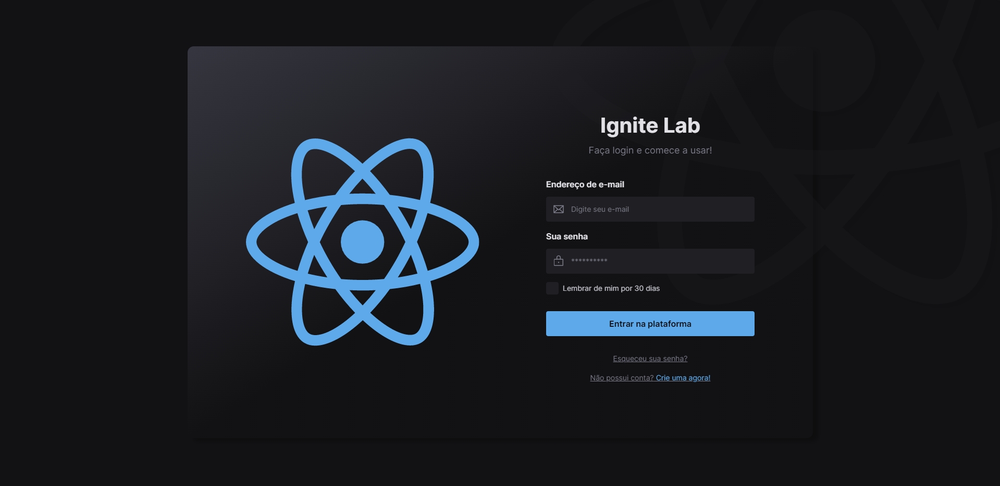
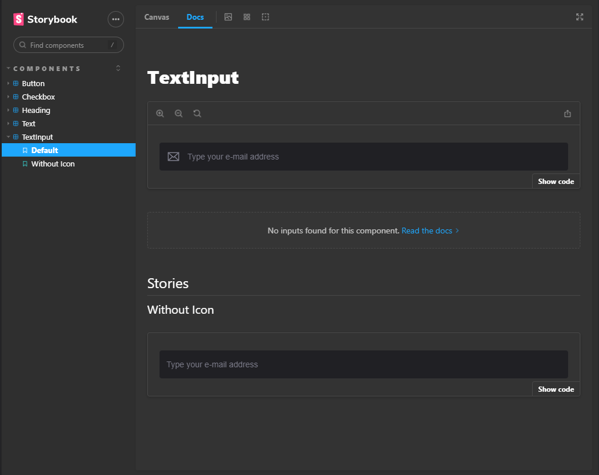

<h1 align="center">
  Ignite lab - Projeto figma para React
</h1>

  
  
  
  
  

  
  
  

  

## 💻 Projeto
Projeto feito na ignite lab 3 da rocketseat, mostrando desde do figma para o código o serviço de um system design no Front-end.

[Clique aqui](https://emanuelhenrique-dev.github.io/Ignite-labDS-Project/) site do storybook da aplicação.

## 🚀 Tecnologias
   ...

- HTML
- CSS
- Vite
- React.js 
- Typescript
- Figma
- Tailwind
- Storybook
- Radix UI 

## 📔 Conhecimentos ensinados

- [x] Uso básico do figma .
- [x] Tokens no figma e utiliza-los no projeto`.
- [x] Base do React.js.
- [x] Uso do Vite na criação do projeto.
- [x] Uso de diversas bibliotecas para ajudar em tarefas específicas.
- [x] Criação do Storybook para visualização dos componentes, facilitando a sua manutenção e personalização a longo prazo.

  

